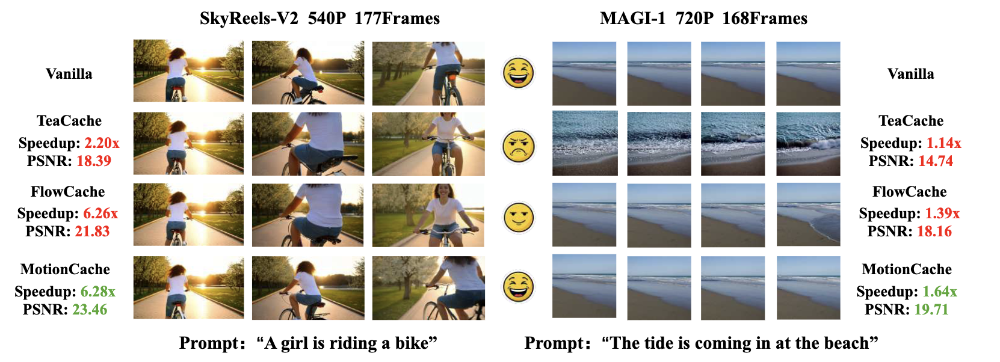
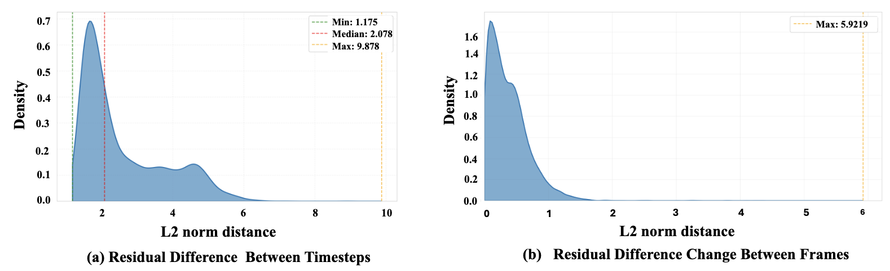
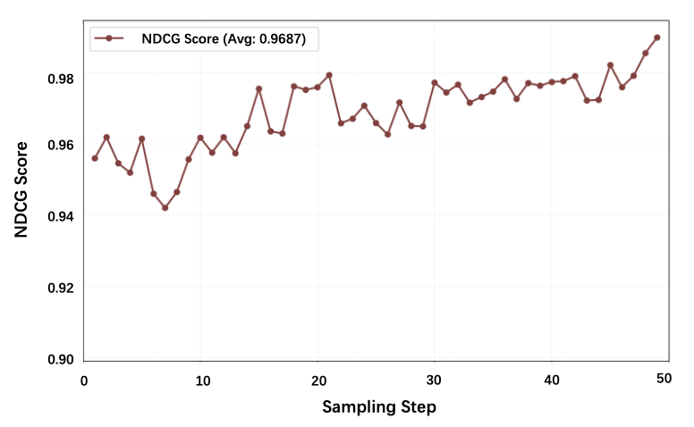
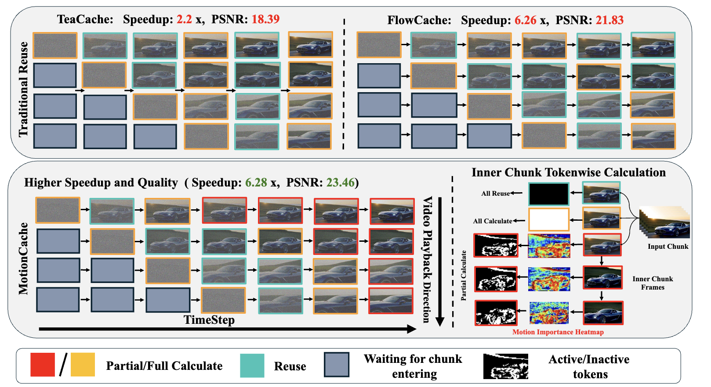
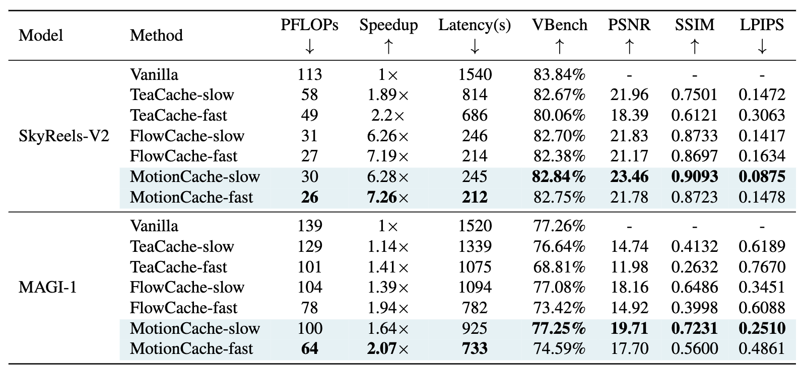

# Motion-Aware Caching for Efficient Autoregressive Video Generation

<div align="center">

**Official implementation of MotionCache**

**[Paper](https://arxiv.org/abs/2605.01725)** | **[Code](https://github.com/ywlq/MotionCache)**

MotionCache is a training-free, motion-aware caching framework for efficient autoregressive video generation.

</div>

---

## Table of Contents

- [Overview](#overview)
- [Method](#method)
- [Main Results](#main-results)
- [Quick Start](#quick-start)
- [Citation](#citation)
- [Acknowledgments](#acknowledgments)

---

## Overview

Autoregressive video generation can synthesize long videos by generating chunks sequentially, but each chunk still requires expensive iterative denoising. Existing cache-reuse methods usually make coarse chunk-level reuse decisions, which can miss fine-grained motion differences inside a video: highly dynamic tokens need more updates, while static tokens can be reused more aggressively.

MotionCache addresses this with motion-aware token-level caching. It uses inter-frame differences as a lightweight proxy for motion importance, then applies motion-weighted reuse so different tokens can receive different update frequencies during generation.



---

## Method

MotionCache follows a coarse-to-fine caching strategy:

- **Warm-up for semantic coherence**: early denoising steps are computed normally to establish stable video content.
- **Motion-aware token weighting**: inter-frame differences estimate which spatial tokens are more motion-sensitive.
- **Token-wise cache reuse**: static or low-motion regions reuse cached activations more aggressively, while high-motion regions are recomputed more often to reduce error accumulation.
- **Model-agnostic integration**: the method is implemented on both [MAGI-1](MotionCache4MAGI-1/) and [SkyReels-V2](MotionCache4SkyReels-V2/) without retraining.







For full derivations and ablations, please refer to the paper.

---

## Main Results

MotionCache improves the speed-quality tradeoff on both SkyReels-V2 and MAGI-1. The table below reports the main VBench results from the paper.



### SkyReels-V2

| Method | PFLOPs | Speedup | Latency (s) | VBench | PSNR | SSIM | LPIPS |
|:--|--:|--:|--:|--:|--:|--:|--:|
| Vanilla | 113 | 1.00x | 1540 | 83.84% | - | - | - |
| TeaCache-slow | 58 | 1.89x | 814 | 82.67% | 21.96 | 0.7501 | 0.1472 |
| TeaCache-fast | 49 | 2.20x | 686 | 80.06% | 18.39 | 0.6121 | 0.3063 |
| FlowCache-slow | 31 | 6.26x | 246 | 82.70% | 21.83 | 0.8733 | 0.1417 |
| FlowCache-fast | 27 | 7.19x | 214 | 82.38% | 21.17 | 0.8697 | 0.1634 |
| **MotionCache-slow** | **30** | **6.28x** | **245** | **82.84%** | **23.46** | **0.9093** | **0.0875** |
| **MotionCache-fast** | **26** | **7.26x** | **212** | **82.75%** | **21.78** | **0.8723** | **0.1478** |

### MAGI-1

| Method | PFLOPs | Speedup | Latency (s) | VBench | PSNR | SSIM | LPIPS |
|:--|--:|--:|--:|--:|--:|--:|--:|
| Vanilla | 139 | 1.00x | 1520 | 77.26% | - | - | - |
| TeaCache-slow | 129 | 1.14x | 1339 | 76.64% | 14.74 | 0.4132 | 0.6189 |
| TeaCache-fast | 101 | 1.41x | 1075 | 68.81% | 11.98 | 0.2632 | 0.7670 |
| FlowCache-slow | 104 | 1.39x | 1094 | 77.08% | 18.16 | 0.6486 | 0.3451 |
| FlowCache-fast | 78 | 1.94x | 782 | 73.42% | 14.92 | 0.3998 | 0.6088 |
| **MotionCache-slow** | **100** | **1.64x** | **925** | **77.25%** | **19.71** | **0.7231** | **0.2510** |
| **MotionCache-fast** | **64** | **2.07x** | **733** | **74.59%** | **17.70** | **0.5600** | **0.4861** |

---

## Quick Start

Environment preparation follows the corresponding base projects and the FlowCache setup style. After dependencies and model checkpoints are ready, run MotionCache with the provided scripts.

### MAGI-1 VBench

```bash
cd MotionCache4MAGI-1
bash scripts/motioncache.sh
```

The script uses [MotionCache4MAGI-1/addconfig/config.yaml](MotionCache4MAGI-1/addconfig/config.yaml) as the MotionCache configuration file.

### SkyReels-V2 VBench

```bash
cd MotionCache4SkyReels-V2
bash run_vbench.sh
```

Please update model paths, VBench prompt paths, GPU IDs, and output directories in the scripts before running.

---

## Citation

If you find MotionCache useful for your research, please cite:

```bibtex
@misc{xu2026motionawarecachingefficientautoregressive,
      title={Motion-Aware Caching for Efficient Autoregressive Video Generation},
      author={Jing Xu and Yuexiao Ma and Xuzhe Zheng and Xing Wang and Shiwei Liu and Chenqian Yan and Xiawu Zheng and Rongrong Ji and Fei Chao and Songwei Liu},
      year={2026},
      eprint={2605.01725},
      archivePrefix={arXiv},
      primaryClass={cs.CV},
      url={https://arxiv.org/abs/2605.01725}
}
```

---

## Acknowledgments

This repository builds on the following projects:

- [MAGI-1](https://github.com/SandAI-org/MAGI-1)
- [SkyReels-V2](https://github.com/SkyworkAI/SkyReels-V2)
- [TeaCache](https://github.com/ali-vilab/TeaCache)
- [FlowCache](https://github.com/ByteDance-Seed/FlowCache)
